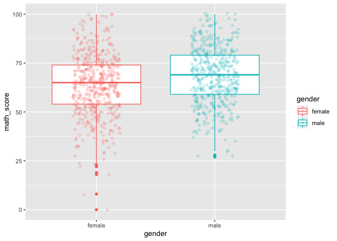
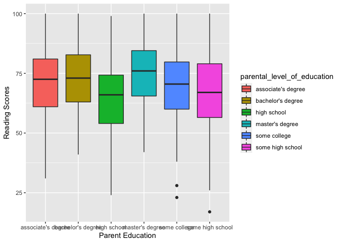
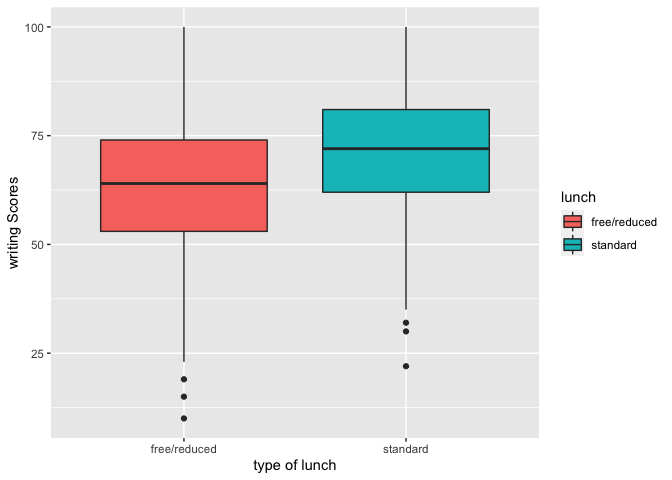

## Set up 

```r
# Checking if there is any missing values, which returns none
which(is.na(exam), arr.ind=TRUE)
```

```
##      row col
```

```r
# Renaming columns
colnames(exam)<-gsub("\\.","\\_",colnames(exam))
# Shows changes
head(exam, 3)
```

```
##   gender race_ethnicity parental_level_of_education    lunch
## 1 female        group B           bachelor's degree standard
## 2 female        group C                some college standard
## 3 female        group B             master's degree standard
##   test_preparation_course math_score reading_score writing_score
## 1                    none         72            72            74
## 2               completed         69            90            88
## 3                    none         90            95            93
```

```r
# Summary of data
summary(exam)
```

```
##     gender          race_ethnicity     parental_level_of_education
##  Length:1000        Length:1000        Length:1000                
##  Class :character   Class :character   Class :character           
##  Mode  :character   Mode  :character   Mode  :character           
##                                                                   
##                                                                   
##                                                                   
##     lunch           test_preparation_course   math_score     reading_score   
##  Length:1000        Length:1000             Min.   :  0.00   Min.   : 17.00  
##  Class :character   Class :character        1st Qu.: 57.00   1st Qu.: 59.00  
##  Mode  :character   Mode  :character        Median : 66.00   Median : 70.00  
##                                             Mean   : 66.09   Mean   : 69.17  
##                                             3rd Qu.: 77.00   3rd Qu.: 79.00  
##                                             Max.   :100.00   Max.   :100.00  
##  writing_score   
##  Min.   : 10.00  
##  1st Qu.: 57.75  
##  Median : 69.00  
##  Mean   : 68.05  
##  3rd Qu.: 79.00  
##  Max.   :100.00
```

## Does gender affect performance?

```r
num_gender <- tabyl(exam, gender)

plot_gender <- ggplot(data = exam, 
                      aes(x = gender,
                          fill = gender)) + 
               geom_bar(stat = "count") +
               xlab("Gender") + 
               ylab("Count") +
               ggtitle("Male Female Ratio")

mean_gender <- aggregate(exam[, 6:8], by = list(exam$gender), FUN = mean, na.rm = T)

# Comparing math score by gender  
gender_math_graph <- exam %>% select(gender, `math_score`) %>% filter(!is.na(math_score)) %>% ggplot(aes(x=gender, y = math_score, color = gender)) + geom_boxplot() + geom_jitter(width = 0.2, alpha = 0.2)


# Comparing reading score by gender 
gender_reading_graph <- exam %>% select(gender, `reading_score`) %>% filter(!is.na(reading_score)) %>% ggplot(aes(x=gender, y = reading_score, color = gender)) + geom_boxplot() + geom_jitter(width = 0.2, alpha = 0.2)


#Comparing writing score by gender 
gender_writing_graph <- exam %>% select(gender, `writing_score`) %>% filter(!is.na(writing_score)) %>% ggplot(aes(x=gender, y = writing_score, color = gender)) + geom_boxplot() + geom_jitter(width = 0.2, alpha = 0.2)
```

## Does gender affect performance?

```
##  gender   n percent
##  female 518   0.518
##    male 482   0.482
```

<!-- -->

```
##   Group.1 math_score reading_score writing_score
## 1  female   63.63320      72.60811      72.46718
## 2    male   68.72822      65.47303      63.31120
```

<!-- --><!-- --><!-- -->

Analysis  <br>1. 518 female and 482 male students.<br>
          <br>2. Female students performed better on reading and writing     
           section.<br>
          <br>3. Based on this dataset, a correlation between students' performance 
           and their gender is quite unclear.<br>

## Does race/ethinicity affect performance?

```r
num_race <- tabyl(exam, race_ethnicity)

plot_race <- ggplot(data = exam, 
                      aes(x = race_ethnicity,
                          fill = race_ethnicity)) + 
               geom_bar(stat = "count") +
               xlab("Race") + 
               ylab("Count") +
               ggtitle("Race Ratio")

mean_race <- aggregate(exam[, 6:8], by = list(exam$race_ethnicity), FUN = mean, na.rm = T)

math_race = ggplot(data = exam) + 
  geom_boxplot(mapping = aes(x = race_ethnicity, y = math_score, fill = race_ethnicity)) +
  labs(x = "Race/Ethnicity", y = "Math Scores")


reading_race = ggplot(data = exam) + 
  geom_boxplot(mapping = aes(x = race_ethnicity, y = reading_score, fill = race_ethnicity)) +
  labs(x = "Race/Ethnicity", y = "Reading Scores")
  

writing_race = ggplot(data = exam) +
  geom_boxplot(mapping = aes(x = race_ethnicity, y = writing_score, fill = race_ethnicity)) +
  labs(x = "Race/Ethnicity", y = "Writing Scores")
```


```
##  race_ethnicity   n percent
##         group A  89   0.089
##         group B 190   0.190
##         group C 319   0.319
##         group D 262   0.262
##         group E 140   0.140
```

<!-- -->

```
##   Group.1 math_score reading_score writing_score
## 1 group A   61.62921      64.67416      62.67416
## 2 group B   63.45263      67.35263      65.60000
## 3 group C   64.46395      69.10345      67.82759
## 4 group D   67.36260      70.03053      70.14504
## 5 group E   73.82143      73.02857      71.40714
```

<!-- --><!-- --><!-- -->


Analysis   <br>1. This dataset contains 89 of group A, 190 of group B,319 of group C
           , 262 of group D, and 140 of group E.<br>
           <br>2. In overall, While group E performed the best, group A performed 
           the worst.<br>
           <br>3. Based on this dataset, there is a positive correlation between 
           students' performance and their racial background/ethnicity.<br>
           
## Does parental education affect performance? 

```r
num_parent <- tabyl(exam, parental_level_of_education)

plot_parental_level_of_education <- ggplot(data = exam, 
                      aes(x = parental_level_of_education,
                          fill = parental_level_of_education)) + 
               geom_bar(stat = "count") +
               xlab("Parental level of education") + 
               ylab("Count") +
               ggtitle("Parental level of education Ratio")

mean_parent <- aggregate(exam[, 6:8], by = list(exam$parental_level_of_education), FUN = mean, na.rm = T)

math_parent = ggplot(data = exam) + 
  geom_boxplot(mapping = aes(x = parental_level_of_education, y = math_score, fill = parental_level_of_education)) +
  labs(x = "Parent Education", y = "Math Scores")


reading_parent = ggplot(data = exam) + 
  geom_boxplot(mapping = aes(x = parental_level_of_education, y = reading_score, fill = parental_level_of_education)) +
  labs(x = "Parent Education", y = "Reading Scores")
  

writing_parent = ggplot(data = exam) +
  geom_boxplot(mapping = aes(x = parental_level_of_education, y = writing_score, fill = parental_level_of_education)) +
  labs(x = "Parent Education", y = "Writing Scores")
```


```
##  parental_level_of_education   n percent
##           associate's degree 222   0.222
##            bachelor's degree 118   0.118
##                  high school 196   0.196
##              master's degree  59   0.059
##                 some college 226   0.226
##             some high school 179   0.179
```

<!-- -->

```
##              Group.1 math_score reading_score writing_score
## 1 associate's degree   67.88288      70.92793      69.89640
## 2  bachelor's degree   69.38983      73.00000      73.38136
## 3        high school   62.13776      64.70408      62.44898
## 4    master's degree   69.74576      75.37288      75.67797
## 5       some college   67.12832      69.46018      68.84071
## 6   some high school   63.49721      66.93855      64.88827
```

<!-- --><!-- --><!-- -->


Analysis   <br>1. In this dataset, there are 222 of associate's degree, 118 of
           bachelor's degree, 196 high school, 59 of master's degree, 226 of
           some college, 179 of some high school as parental level of education.<br> 
           <br>2. In overall, while the students whose parents have master degree 
           performed the best, the students whose parents have high school 
           performed the worst.<br>
           <br>3. Based on this dataset, there is a positive correlation between 
           students' performance and their parental level of education.<br>

## Does type of lunch affect performance?

```r
num_lunch <- tabyl(exam, lunch)

plot_lunch <- ggplot(data = exam,
                aes(x = lunch, fill = lunch)) +
         geom_bar(stat = "Count")

lunch_stat <- aggregate(exam[, 6:8], by = list(exam$lunch), FUN = mean, na.rm = T)

lunch_graph_math = ggplot(data = exam) + 
  geom_boxplot(mapping = aes(x = lunch, y = math_score, fill = lunch)) +
  labs(x = "type of lunch", y = "Math Scores")

lunch_graph_reading = ggplot(data = exam) + 
  geom_boxplot(mapping = aes(x = lunch, y = reading_score, fill = lunch)) +
  labs(x = "type of lunch", y = "Reading Scores")

lunch_graph_writing = ggplot(data = exam) + 
  geom_boxplot(mapping = aes(x = lunch, y = writing_score, fill = lunch)) +
  labs(x = "type of lunch", y = "writing Scores")
```


```
##         lunch   n percent
##  free/reduced 355   0.355
##      standard 645   0.645
```

<!-- -->

```
##        Group.1 math_score reading_score writing_score
## 1 free/reduced   58.92113      64.65352      63.02254
## 2     standard   70.03411      71.65426      70.82326
```

<!-- --><!-- --><!-- -->


Analysis   <br>1. In this dataset, there are 355 students who receive free/reduced 
           lunch and 645 students who pay regular amount for lunch.<br>
           <br>2. Though the students who have standard lunch type are almost double
           of the students who receive free/reduced lunch, they performed much 
           better than the students' with reduced/free lunch in overall.<br>
           <br>3. Based on this dataset, there is a correlation between students' 
           performance and their lunch type.<br>
           

```r
# Predicting the reading score by using writing score
cor(exam$reading_score,exam$writing_score)
```

```
## [1] 0.9545981
```

```r
score <- exam[,-2:-5]

ggplot(exam,aes(x=reading_score,y=writing_score))+
geom_point()+
stat_smooth(method= "lm",col="blue")
```

```
## `geom_smooth()` using formula 'y ~ x'
```

<!-- -->

```r
# Split data set into 2 
split <- sample.split(score,SplitRatio = 0.75)
train <- subset(score, split="TRUE")
test <- subset(score, split="FALSE")

# Linear Model
lm <- lm(exam$reading_score~exam$writing_score,data=train)
summary(lm)
```

```
## 
## Call:
## lm(formula = exam$reading_score ~ exam$writing_score, data = train)
## 
## Residuals:
##      Min       1Q   Median       3Q      Max 
## -14.6226  -2.9554   0.1352   3.0399  11.4602 
## 
## Coefficients:
##                    Estimate Std. Error t value Pr(>|t|)    
## (Intercept)         6.75051    0.63175   10.69   <2e-16 ***
## exam$writing_score  0.91719    0.00906  101.23   <2e-16 ***
## ---
## Signif. codes:  0 '***' 0.001 '**' 0.01 '*' 0.05 '.' 0.1 ' ' 1
## 
## Residual standard error: 4.352 on 998 degrees of freedom
## Multiple R-squared:  0.9113,	Adjusted R-squared:  0.9112 
## F-statistic: 1.025e+04 on 1 and 998 DF,  p-value: < 2.2e-16
```

```r
# Predict the reading score
reading_predict <- predict(lm,train)

# Predict reading data vs Actual reading data 
plot(exam$reading_score,type="l",lty=1.8,col="red")
lines(reading_predict,type="l", col="blue")
```

<!-- -->

```r
# Predict the reading score using math score
cor(exam$reading_score,exam$math_score)
```

```
## [1] 0.8175797
```

```r
ggplot(exam,aes(x=reading_score,y=math_score))+
geom_point()+
stat_smooth(method= "lm",col="blue")
```

```
## `geom_smooth()` using formula 'y ~ x'
```

<!-- -->

```r
lm_df <- lm(score$reading_score~score$math_score,data=train)
summary(lm_df)
```

```
## 
## Call:
## lm(formula = score$reading_score ~ score$math_score, data = train)
## 
## Residuals:
##      Min       1Q   Median       3Q      Max 
## -26.2905  -5.8011   0.1139   6.0341  21.4117 
## 
## Coefficients:
##                  Estimate Std. Error t value Pr(>|t|)    
## (Intercept)      17.14181    1.19000   14.40   <2e-16 ***
## score$math_score  0.78723    0.01755   44.85   <2e-16 ***
## ---
## Signif. codes:  0 '***' 0.001 '**' 0.01 '*' 0.05 '.' 0.1 ' ' 1
## 
## Residual standard error: 8.411 on 998 degrees of freedom
## Multiple R-squared:  0.6684,	Adjusted R-squared:  0.6681 
## F-statistic:  2012 on 1 and 998 DF,  p-value: < 2.2e-16
```

```r
reading_predict_2 <- predict(lm_df,train)

# Predicted reading score vs actual reading score
plot(score$reading_score,type="l",col="red")
lines(reading_predict_2,type="l",col="blue")
```

<!-- -->
<br> Successfully predicted reading score by using writing and math score.<br>
<br> The predicted score is very close to the actual data. <br> 
