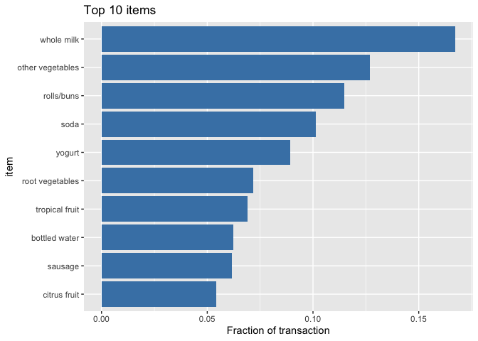
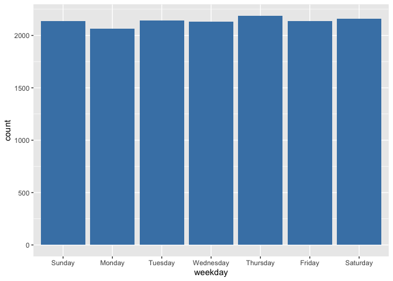
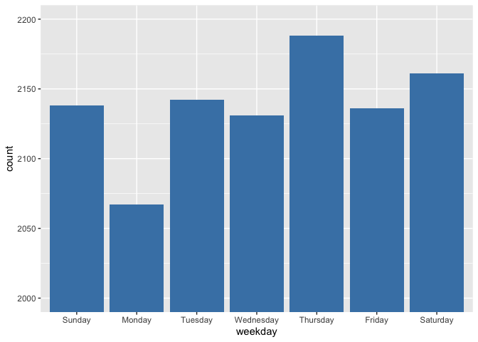
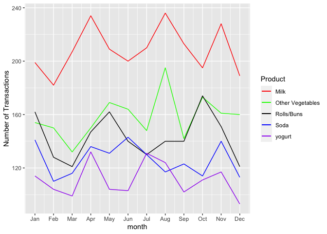

#### Before clean up  

| Member_number|Date       |itemDescription  |
|-------------:|:----------|:----------------|
|          1808|21-07-2015 |tropical fruit   |
|          2552|05-01-2015 |whole milk       |
|          2300|19-09-2015 |pip fruit        |
|          1187|12-12-2015 |other vegetables |
|          3037|01-02-2015 |whole milk       |
|          4941|14-02-2015 |rolls/buns       |


```r
# Checking NA values
sum(is.na(grocery))
```

```
## [1] 0
```

```r
# Rename and re-class the columns
names(grocery) <- c("member_id", "date", "item")
grocery$member_id <- as_factor(grocery$member_id)
grocery$date <- as_date(dmy(grocery$date))
grocery$item <- as_factor(grocery$item)
# Create new columns with number of dates since #epoch date(January 1, 1970).
grocery$trans_id <- as_factor(paste0(grocery$member_id, unclass(grocery$date)))
grocery$month <- month(grocery$date)
grocery$weekday <- weekdays(grocery$date)

item_list <- unique(grocery$item)
num_items <- length(list)
member_list <- unique(grocery$member_id)
num_members <- length(member_list)

# Showing number of transactions. 
num_trans <- length(unique(grocery$trans_id))
paste0("From 2014 to 2015, there were ",num_trans, " transactions.")
```

```
## [1] "From 2014 to 2015, there were 14963 transactions."
```


#### After clean up 

|member_id |date       |item             |trans_id  | month|weekday  |
|:---------|:----------|:----------------|:---------|-----:|:--------|
|1808      |2015-07-21 |tropical fruit   |180816637 |     7|Tuesday  |
|2552      |2015-01-05 |whole milk       |255216440 |     1|Monday   |
|2300      |2015-09-19 |pip fruit        |230016697 |     9|Saturday |
|1187      |2015-12-12 |other vegetables |118716781 |    12|Saturday |
|3037      |2015-02-01 |whole milk       |303716467 |     2|Sunday   |
|4941      |2015-02-14 |rolls/buns       |494116480 |     2|Saturday |

<br> Here is the list of items purchased. <br> 

```
##   [1] tropical fruit            whole milk               
##   [3] pip fruit                 other vegetables         
##   [5] rolls/buns                pot plants               
##   [7] citrus fruit              beef                     
##   [9] frankfurter               chicken                  
##  [11] butter                    fruit/vegetable juice    
##  [13] packaged fruit/vegetables chocolate                
##  [15] specialty bar             butter milk              
##  [17] bottled water             yogurt                   
##  [19] sausage                   brown bread              
##  [21] hamburger meat            root vegetables          
##  [23] pork                      pastry                   
##  [25] canned beer               berries                  
##  [27] coffee                    misc. beverages          
##  [29] ham                       turkey                   
##  [31] curd cheese               red/blush wine           
##  [33] frozen potato products    flour                    
##  [35] sugar                     frozen meals             
##  [37] herbs                     soda                     
##  [39] detergent                 grapes                   
##  [41] processed cheese          fish                     
##  [43] sparkling wine            newspapers               
##  [45] curd                      pasta                    
##  [47] popcorn                   finished products        
##  [49] beverages                 bottled beer             
##  [51] dessert                   dog food                 
##  [53] specialty chocolate       condensed milk           
##  [55] cleaner                   white wine               
##  [57] meat                      ice cream                
##  [59] hard cheese               cream cheese             
##  [61] liquor                    pickled vegetables       
##  [63] liquor (appetizer)        UHT-milk                 
##  [65] candy                     onions                   
##  [67] hair spray                photo/film               
##  [69] domestic eggs             margarine                
##  [71] shopping bags             salt                     
##  [73] oil                       whipped/sour cream       
##  [75] frozen vegetables         sliced cheese            
##  [77] dish cleaner              baking powder            
##  [79] specialty cheese          salty snack              
##  [81] Instant food products     pet care                 
##  [83] white bread               female sanitary products 
##  [85] cling film/bags           soap                     
##  [87] frozen chicken            house keeping products   
##  [89] spread cheese             decalcifier              
##  [91] frozen dessert            vinegar                  
##  [93] nuts/prunes               potato products          
##  [95] frozen fish               hygiene articles         
##  [97] artif. sweetener          light bulbs              
##  [99] canned vegetables         chewing gum              
## [101] canned fish               cookware                 
## [103] semi-finished bread       cat food                 
## [105] bathroom cleaner          prosecco                 
## [107] liver loaf                zwieback                 
## [109] canned fruit              frozen fruits            
## [111] brandy                    baby cosmetics           
## [113] spices                    napkins                  
## [115] waffles                   sauces                   
## [117] rum                       chocolate marshmallow    
## [119] long life bakery product  bags                     
## [121] sweet spreads             soups                    
## [123] mustard                   specialty fat            
## [125] instant coffee            snack products           
## [127] organic sausage           soft cheese              
## [129] mayonnaise                dental care              
## [131] roll products             kitchen towels           
## [133] flower soil/fertilizer    cereals                  
## [135] meat spreads              dishes                   
## [137] male cosmetics            candles                  
## [139] whisky                    tidbits                  
## [141] cooking chocolate         seasonal products        
## [143] liqueur                   abrasive cleaner         
## [145] syrup                     ketchup                  
## [147] cream                     skin care                
## [149] rubbing alcohol           nut snack                
## [151] cocoa drinks              softener                 
## [153] organic products          cake bar                 
## [155] honey                     jam                      
## [157] kitchen utensil           flower (seeds)           
## [159] rice                      tea                      
## [161] salad dressing            specialty vegetables     
## [163] pudding powder            ready soups              
## [165] make up remover           toilet cleaner           
## [167] preservation products    
## 167 Levels: tropical fruit whole milk pip fruit other vegetables ... preservation products
```


```r
count <- count(grocery, grocery$item)
names(count) <- c("item", "num")

# sort items by number of times purchased
sorted_count <- count[order(-count$num),]

# Add a field that converts count to fraction of total purchases
sorted_count$portion <- sorted_count$num/num_trans

top_ten <- sorted_count[1:10,]
# Reverse the order for horizontal Pareto chart
top_ten_rev<- sorted_count[10:1,]

#graph for top ten
top_ten$item <- factor(top_ten$item, levels = top_ten_rev$item)
top_ten_graph <- ggplot(data = top_ten, aes(x = item, y = portion)) +
                   geom_bar(stat = "identity", fill = "steelblue") +
                   labs(title = "Top 10 items", y = "Fraction of transaction") +
                   coord_flip()
```


```
##                item  num    portion
## 2        whole milk 2502 0.16721246
## 4  other vegetables 1898 0.12684622
## 5        rolls/buns 1716 0.11468288
## 38             soda 1514 0.10118292
## 18           yogurt 1334 0.08915324
## 22  root vegetables 1071 0.07157656
## 1    tropical fruit 1032 0.06897013
## 17    bottled water  933 0.06235381
## 19          sausage  924 0.06175232
## 7      citrus fruit  812 0.05426719
```

<!-- -->

#### Transaction made by day

```r
# Presents shopping trips by  transaction id
day <- unique(data.frame(weekday = grocery$weekday, trans_id = grocery$trans_id))

# Puts days in order 
day$weekday <- factor(day$weekday, levels = c('Sunday', 'Monday', 'Tuesday',
                               'Wednesday', 'Thursday', 'Friday', 'Saturday'))
# Arrange shopping trips by days of the week count them by day
daily_trans <- day %>%
  group_by(weekday) %>%
  dplyr::summarize(n = n())
  
per_day <- ggplot(data = day, aes(x = weekday), ) +
  geom_bar(fill = "steelblue")
```

<!-- -->

<br> Zooming in due to unclear difference <br>
<!-- -->


```r
milk <- grocery[grocery$item == "whole milk",-c(1,2,3,6)]
other_veg <- grocery[grocery$item == "other vegetables",-c(1,2,3,6)]
root_veg <- grocery[grocery$item == "root vegetables",-c(1,2,3,6)]
rolls <- grocery[grocery$item == "rolls/buns",-c(1,2,3,6)]
soda <- grocery[grocery$item == "soda",-c(1,2,3,6)]
yogurt <- grocery[grocery$item == "yogurt",-c(1,2,3,6)]
tropic_fruit <- grocery[grocery$item == "tropical fruit",-c(1,2,3,6)]
citrus_fruit <- grocery[grocery$item == "citrus fruit",-c(1,2,3,6)]
water <- grocery[grocery$item == "bottled water",-c(1,2,3,6)]
sausage <- grocery[grocery$item == "sausage",-c(1,2,3,6)]

# Combine two years of data and group by month of the year
by_month <- function(x) {
    x %>%
        group_by(month) %>%
        dplyr::summarize(num = n())
}

month_milk <- by_month(milk)
month_other_veg <- by_month(other_veg)
month_root_veg <- by_month(root_veg)
month_rolls <- by_month(rolls)
month_soda <- by_month(soda)
month_yogurt <- by_month(yogurt)
month_tropic_fruit <- by_month(tropic_fruit)
month_citrus_fruit <- by_month(citrus_fruit)
month_water <- by_month(water)
month_sausage <- by_month(sausage)

month_table <- data.frame(month = as.numeric(c(1:12)),
                                           milk = month_milk$num,
                                           other_veg = month_other_veg$num,
                                           root_veg = month_root_veg$num,
                                           rolls = month_rolls$num,
                                           soda = month_soda$num,
                                           yogurt = month_yogurt$num,
                                           tropic_fruit = month_tropic_fruit$num,
                                           citrus_fruit =month_citrus_fruit$num,
                                           water = month_water$num,
                                           sausage = month_sausage$num)
```


| month| milk| other_veg| root_veg| rolls| soda| yogurt| tropic_fruit| citrus_fruit| water| sausage|
|-----:|----:|---------:|--------:|-----:|----:|------:|------------:|------------:|-----:|-------:|
|     1|  199|       154|       92|   162|  141|    114|           97|           70|    68|      79|
|     2|  182|       150|       83|   128|  110|    104|           70|           73|    72|      81|
|     3|  207|       132|       85|   121|  116|     99|           90|           75|    78|      90|
|     4|  234|       150|       82|   147|  136|    132|          103|           64|    64|      66|
|     5|  209|       169|       96|   162|  131|    104|           94|           79|    92|      87|
|     6|  200|       164|       89|   140|  143|    103|           77|           71|    75|      72|
|     7|  210|       148|       87|   130|  130|    131|           84|           63|    83|      86|
|     8|  236|       195|       95|   140|  117|    124|           84|           75|    72|      81|
|     9|  213|       142|       80|   140|  123|    102|           67|           60|    67|      71|
|    10|  195|       173|       87|   174|  114|    111|          105|           65|    81|      74|
|    11|  228|       161|      107|   151|  140|    117|           86|           65|    89|      62|
|    12|  189|       160|       88|   121|  113|     93|           75|           52|    92|      75|


```r
# Plotting top six
top_six <- ggplot(data = month_table, aes(x = month)) +
    geom_line(aes(y = milk, color = "red")) +    
    geom_line(aes(y = other_veg, color = "green")) + 
    geom_line(aes(y = rolls, color = "black")) +
    geom_line(aes(y = soda, color = "blue")) +
    geom_line(aes(y = yogurt, color = "purple")) +
    scale_x_continuous("month", 
                       breaks = c(1:12), 
                       labels = month.abb) +
    ylab("Number of Transactions") +

    scale_color_identity(name = "Product",
                         breaks = c("red", "green", "black", "blue", "purple"),
                         labels = c("Milk", "Other Vegetables", "Rolls/Buns", "Soda", "yogurt"),
                         guide = "legend")
```

<!-- -->
