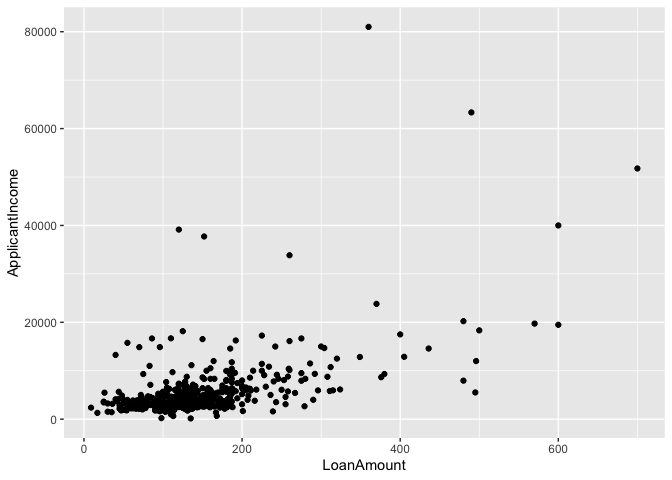
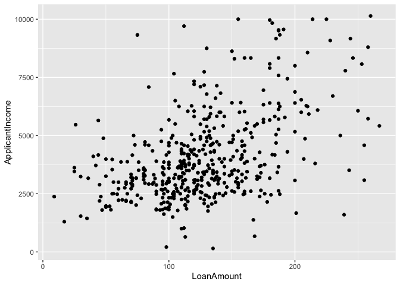
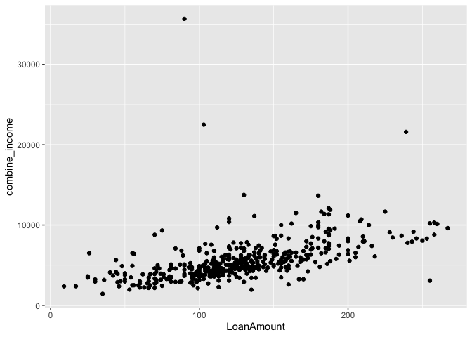
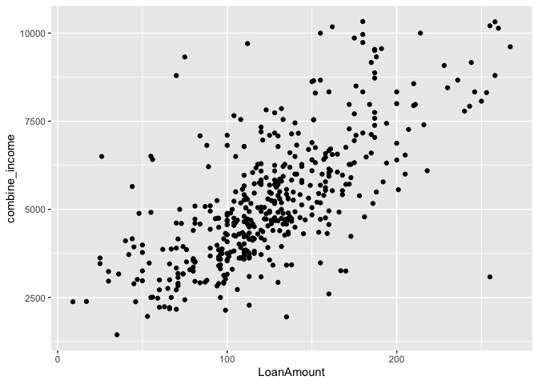
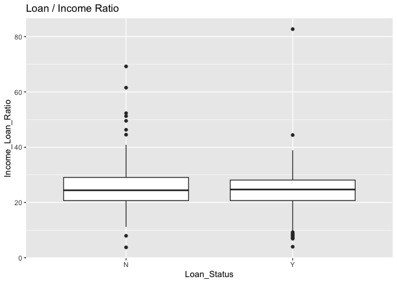
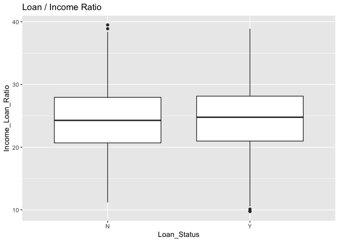

# Data cleaning
Checking and erasing missing data. 


```r
# Dataset of 614 loan ID
loan <- read.csv(file = "loanapproval.csv") 

#Indicates rows and columns of missing data
which(is.na(loan), arr.ind=TRUE)
```

```
##       row col
##  [1,]   1   9
##  [2,]  36   9
##  [3,]  64   9
##  [4,]  82   9
##  [5,]  96   9
##  [6,] 103   9
##  [7,] 104   9
##  [8,] 114   9
##  [9,] 128   9
## [10,] 203   9
## [11,] 285   9
## [12,] 306   9
## [13,] 323   9
## [14,] 339   9
## [15,] 388   9
## [16,] 436   9
## [17,] 438   9
## [18,] 480   9
## [19,] 525   9
## [20,] 551   9
## [21,] 552   9
## [22,] 606   9
## [23,]  20  10
## [24,]  37  10
## [25,]  45  10
## [26,]  46  10
## [27,]  74  10
## [28,] 113  10
## [29,] 166  10
## [30,] 198  10
## [31,] 224  10
## [32,] 233  10
## [33,] 336  10
## [34,] 368  10
## [35,] 422  10
## [36,] 424  10
## [37,]  17  11
## [38,]  25  11
## [39,]  31  11
## [40,]  43  11
## [41,]  80  11
## [42,]  84  11
## [43,]  87  11
## [44,]  96  11
## [45,] 118  11
## [46,] 126  11
## [47,] 130  11
## [48,] 131  11
## [49,] 157  11
## [50,] 182  11
## [51,] 188  11
## [52,] 199  11
## [53,] 220  11
## [54,] 237  11
## [55,] 238  11
## [56,] 260  11
## [57,] 261  11
## [58,] 280  11
## [59,] 310  11
## [60,] 314  11
## [61,] 318  11
## [62,] 319  11
## [63,] 324  11
## [64,] 349  11
## [65,] 364  11
## [66,] 378  11
## [67,] 393  11
## [68,] 396  11
## [69,] 412  11
## [70,] 445  11
## [71,] 450  11
## [72,] 452  11
## [73,] 461  11
## [74,] 474  11
## [75,] 491  11
## [76,] 492  11
## [77,] 498  11
## [78,] 504  11
## [79,] 507  11
## [80,] 531  11
## [81,] 534  11
## [82,] 545  11
## [83,] 557  11
## [84,] 566  11
## [85,] 584  11
## [86,] 601  11
```

```r
#Removes rows with missing data. 
loan <- na.omit(loan)

#Showing cleaned dataset of 529 loan Id. 
head(loan, )
```

```
##    Loan_ID Gender Married Dependents    Education Self_Employed ApplicantIncome
## 2 LP001003   Male     Yes          1     Graduate            No            4583
## 3 LP001005   Male     Yes          0     Graduate           Yes            3000
## 4 LP001006   Male     Yes          0 Not Graduate            No            2583
## 5 LP001008   Male      No          0     Graduate            No            6000
## 6 LP001011   Male     Yes          2     Graduate           Yes            5417
## 7 LP001013   Male     Yes          0 Not Graduate            No            2333
##   CoapplicantIncome LoanAmount Loan_Amount_Term Credit_History Property_Area
## 2              1508        128              360              1         Rural
## 3                 0         66              360              1         Urban
## 4              2358        120              360              1         Urban
## 5                 0        141              360              1         Urban
## 6              4196        267              360              1         Urban
## 7              1516         95              360              1         Urban
##   Loan_Status
## 2           N
## 3           Y
## 4           Y
## 5           Y
## 6           Y
## 7           Y
```

# Visualization 

```r
#Presents relationship between applicant's income and amount of loan in a scatter plot
ggplot(data = loan) + 
  geom_point(mapping = aes(x = LoanAmount, y = ApplicantIncome ))
```

<!-- -->

```r
#Correlation is unclear due to outliers

#Removes outlier of loan amount and applicant's income
loan_xoutlier <- loan

boxplot(loan$LoanAmount, plot=FALSE)$out
```

```
##  [1] 349 315 320 286 312 370 290 600 275 700 495 280 279 304 436 480 300 376 490
## [20] 308 570 380 296 275 360 405 500 311 480 400 324 600 275 292 496
```

```r
loan_Amount_outliers <- boxplot(loan$LoanAmount, plot=FALSE)$out
loan_xoutlier <- loan_xoutlier[-which(loan_xoutlier$LoanAmount %in% loan_Amount_outliers),]

boxplot(loan$ApplicantIncome, plot=FALSE)$out
```

```
##  [1] 12841 12500 11500 10750 11417 14583 10408 23803 10513 14999 11757 14866
## [13] 39999 51763 33846 39147 12000 11000 16250 14683 11146 14583 20233 15000
## [25] 63337 19730 15759 81000 14880 12876 10416 37719 16692 16525 16667 10833
## [37] 18333 17263 13262 17500 18165 19484 16666 16120 12000
```

```r
income_outliers <- boxplot(loan$ApplicantIncome, plot=FALSE)$out
loan_xoutlier <- loan_xoutlier[-which(loan_xoutlier$ApplicantIncome %in% income_outliers),]


#Presents relationship between applicant's income and amount of loan in a scatter plot without outliers. 469 loan IDs. The graph indicates a positive correlation. 
ggplot(data = loan_xoutlier) + 
  geom_point(mapping = aes(x = LoanAmount, y = ApplicantIncome ))
```

<!-- -->


```r
#Add income of applicants and coapplicants
loan_xoutlier$combine_income <- loan_xoutlier[,7] + loan_xoutlier[,8]

as.integer(loan_xoutlier$combine_income)
```

```
##   [1]  6091  3000  4941  6000  9613  3849  5540  5532  3900  4340 11179  4693
##  [13]  2385  4950  3510  4887  7660  4511  5282  9560  5052  5266  1442  5833
##  [25]  3167  4692  5167  5126 11376  5416  3600  3013  6277  5649  5821  6085
##  [37]  6275  3572  3086  4230  4616  3875  3723  5566 10330  6216  6296  3029
##  [49]  6058  4166 10321  5454  7100  4300  6274  3750  3500  7040  3750  8500
##  [61]  4022  7167  3846  3259  3988  4897  4618  8566  9862  5858 11904  5093
##  [73]  4133  3620  4786  2974  4188  5300  7551  8649  4570  4082  7333  7400
##  [85]  2825  5316  5262  5050  5450  7710  8334  4166 11117  2957  6314  3943
##  [97]  2718  3459  4895  4583  6816  5630  7125  5417  6950  4732  6816  2963
## [109] 11666  5690  6277  6327  9166  2281  3254  9538  5063 10208  2904  4369
## [121]  5614  9323  4583  5772  2237  8000  3589  3522 11333  5080  5461  3664
## [133]  3750  3784 13650  4600  3625  2178  5970  9328  4885  6033  3858  4191
## [145]  5708 12083  5100  4923  4583  3917  4408  3244  6506  2479  3418 10000
## [157]  4680  7787  5703  6194  4833  1950  5502  5000  2221  5726  5762  6250
## [169]  3250  4735  7945  4758  6400  4545  3716  4934  6760  3812  3315 10819
## [181]  4493  8666  7550  7823 10383  9703  6608  4725  3677  5558  3427  4750
## [193]  3083  6045  5250  4269  3481  7200  5166  7542  6095  6144  3418  4436
## [205]  3237  4690  4843  3900  4592  7267  4403  6479  4727  3286  3477  6211
## [217]  4317  5704  4124  9508  5491  4400  4713  5417  5717  5666  6875  4666
## [229]  7541  4939  4734  4625  5000  3428  6500  5428  4263  2917  5332  2507
## [241]  4316  5039  3717 10000  4567  4531  4917  7978  6784  2500  6177  2935
## [253]  2833 11666  5938  7100  4160  4234  2378  5783  3173  4913  4957  6753
## [265]  5251  8875  9083  4749  5500  2928  3813 11500  3875  4666  8334  4723
## [277]  8667  7083  6822  6216  2500  6325  5185  5049  4223  5740 13746  3069
## [289]  5391  5833  6000  7167  4566  3667  3946  4750  5488  9167  3618  4500
## [301]  3180  4492  5568  3300  2889  2755 22500  1963  7441  4547  4567  2213
## [313]  8300  3867  6096  4286  5386  2995  2600 21600  3798  4663  5829  3539
## [325]  6966  4606  5935  2936  2717  8624  6500  4765  3750  3777  7142  8724
## [337]  9734  6700  4676  4652  4915  5050  3564  5681  4949  7085  3859  4301
## [349]  6277  4354  8334  7740  5203  5191  4166  6000  4611  3127  6784  5529
## [361]  4153  4691 10180  8450  4745  4350  3095  5233  8333  4394  3547  6666
## [373]  2435  3691  5754  4239  4300  2895 10699  4328  3159 10489  5297  7926
## [385]  3583  5492  4885  8069  5318  8796  6894  3663  4874  6598  3400  3934
## [397]  2500  7101  3775  6715  3981  6783  4281  3588  4592  3617  3453  6417
## [409]  7453  2138  3652  4763  4718  3358  4309  5000  4801  6583  4787  7859
## [421]  6500 10139  6556  6486  3917  7977  5800  8799  3333  5900  2378  5230
## [433]  5167  6567  7750  6406  3620  5297  5968  4014  6099  6540 35673  3166
## [445]  4704  7283  3819  2165  4750  2726  6416  6000  7159  3833  7383  2987
## [457]  9963  5780  5686  5703  7977  5900  5398  5182  2900  4106  8312  7583
## [469]  4583
```

```r
#Presents relationship betweeen combined income and amount of loan without removing outliers 
ggplot(data = loan_xoutlier) + 
  geom_point(mapping = aes(x = LoanAmount, y = combine_income ))
```

<!-- -->

```r
#Removing outlier in combined income
boxplot(loan_xoutlier$combine_income, plot=FALSE)$out
```

```
##  [1] 11179 11376 11904 11117 11666 11333 13650 12083 10819 10383 11666 11500
## [13] 13746 22500 21600 10699 10489 35673
```

```r
combine_income_outliers <- boxplot(loan_xoutlier$combine_income, plot=FALSE)$out
loan_xoutlier <- loan_xoutlier[-which(loan_xoutlier$combine_income %in% combine_income_outliers),]

#New scatter plot without outliers 
ggplot(data = loan_xoutlier) + 
  geom_point(mapping = aes(x = LoanAmount, y = combine_income ))
```

<!-- -->


```r
#Presenting ratio of approved and disapproved loan status by dividing combined income over loan amount requested. 
loan_xoutlier$Income_Loan_Ratio <-  (loan_xoutlier[,9] * 1000) / loan_xoutlier[,14] 

ggplot(loan_xoutlier, 
       aes(x = Loan_Status, 
           y = Income_Loan_Ratio)) +
  geom_boxplot() +
  labs(title = "Loan / Income Ratio ")
```

<!-- -->

```r
boxplot(loan_xoutlier$Income_Loan_Ratio , plot=FALSE)$out
```

```
##  [1]  7.127883  7.788989 51.242712  6.906077  7.227522 49.539676  8.044621
##  [8]  8.453735 69.230769 52.307692 40.268456 82.711645 44.527435  9.267841
## [15] 40.859707 44.398907 61.538462  7.958163 46.304958  4.000000  3.784693
## [22]  8.728180
```

```r
Income_Loan_Ratio_outliers <- boxplot(loan_xoutlier$Income_Loan_Ratio, plot=FALSE)$out
loan_xoutlier <- loan_xoutlier[-which(loan_xoutlier$Income_Loan_Ratio %in% Income_Loan_Ratio_outliers),]


ggplot(loan_xoutlier, 
       aes(x = Loan_Status, 
           y = Income_Loan_Ratio)) +
  geom_boxplot() +
  labs(title = "Loan / Income Ratio")
```

<!-- -->

